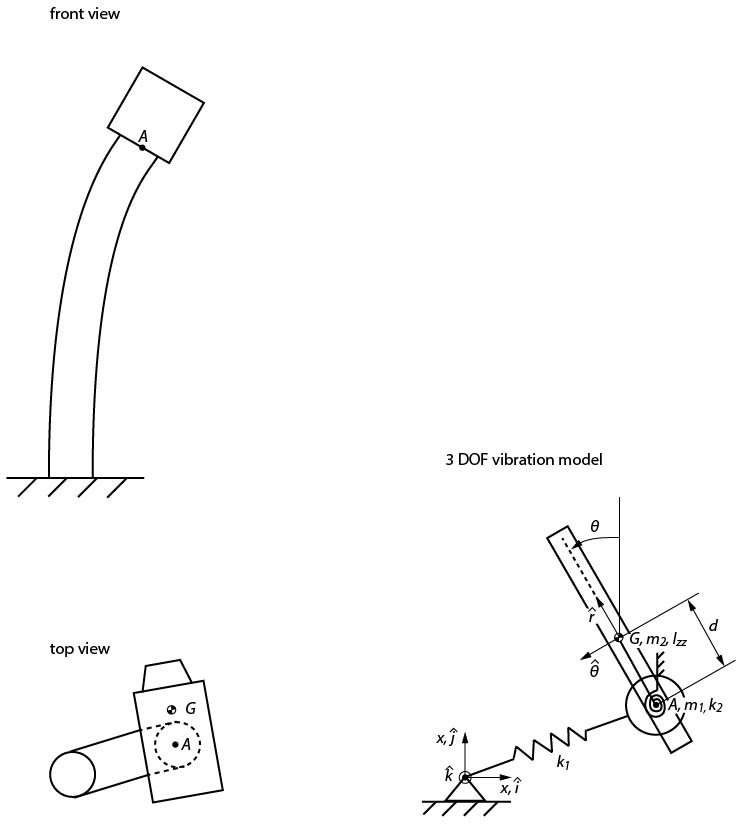

# Modeling the tower's vibration as a 3 DOF system

The tower's oscillation is modeled as a discrete system with three degrees of freedom.

The equations of motions are written [here](2021-07-25_EquationsOfMotion.pdf).
They are derived [here](2021-07-24_EquationsOfMotion_Derivation.pdf) (for a slightly different configuration of the rotating body). 

To simulate the dynamics, run the file [simulate_3dof.m](simulate_3dof.m) with Matlab.

## Dynamics for the point A

If the center of mass is exactly at point A, no orbits occur, see [here](trajectory_d_zero.gif).

## Sketch of the model

